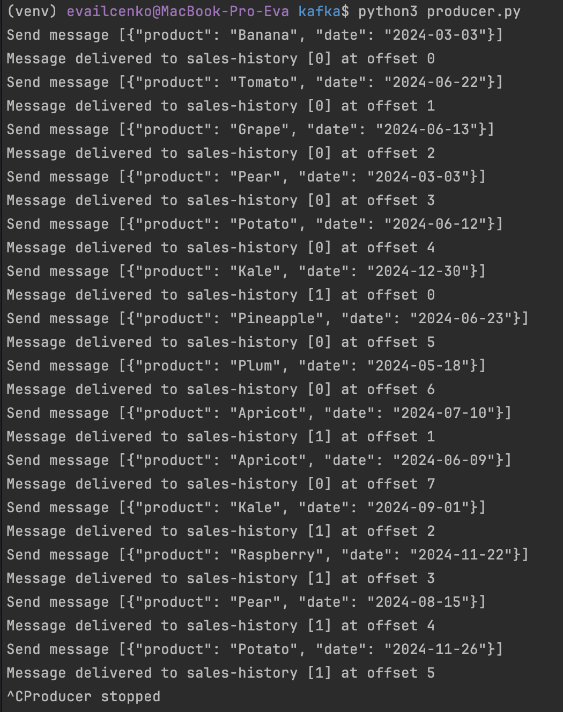
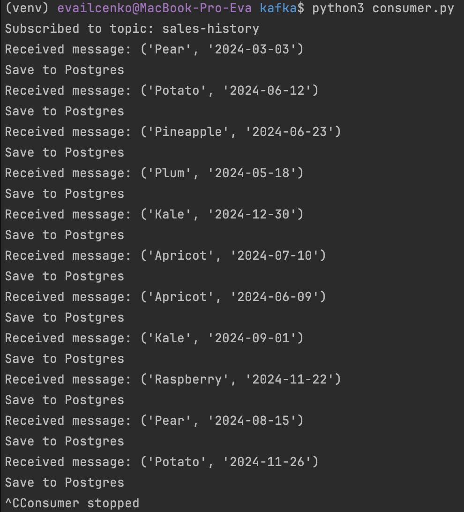
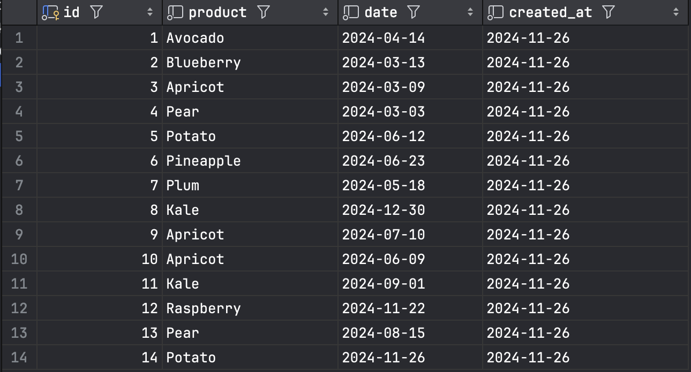

## **Задание: Реализация системы обработки данных в реальном времени с использованием Apache Kafka**

---

## **Описание задания:**
- Развернуть Kafka с помощью Docker compose. В Kafka должно быть 2 брокера для хранения реплики данных
- Название топика: `sales-history`. Количество партицию в топике: 2
- Данные пишутся в определенную партицию в зависимости от того, больше `date` середины года или меньше
- Producer: генерирует случайное название продукта из списка и дату в пределах 2024 года
- Consumer: Записывает полученные данные в Postgres в формате (`id`, `product`, `date`, `created_at`). Здесь `id` вставляется с помощью автоинкремента, в `created_at` подставляется дата записи в таблицу

## **Результат**
- Код producer, consumer, docker-compose.yml
- Фотографии логов отработавших producer и consumer
- Фотография данных записанных в Postgres

## **Фотографии**
### **Producer**

### **Consumer**

### **Postgres**

